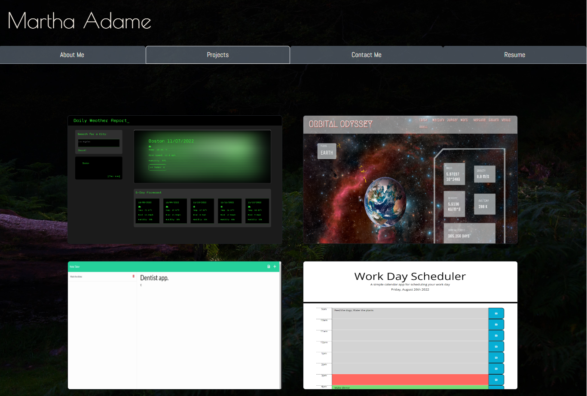

# My Portfolio

  

## Table of Contents

  - [Description](#description)
  - [Licenses](#licenses)
  - [Questions](#questions)
  - [Demo](#demo)

  ---

## Description

This portfolio was created for professional networking, and demonstrating projects. Created using React, Javascript, CSS and React Bootstrap, this portfolio has 4 pages that users can visit. These pages include an About Me, Contact page, Project Portfolio, and a page with a downloadable link to my resume, along with listed skills.

## Licenses

This project is covered by the MIT license. Click on license badge for more information.

## Questions

Email: mladame43@gmail.com

[Visit my Github Profile](https://github.com/mladame)

## Demo

[Visit my React Portfolio](https://mladame.github.io/my-portfolio/)

[Visit my React Portfolio Repository](https://github.com/mladame/my-portfolio)

